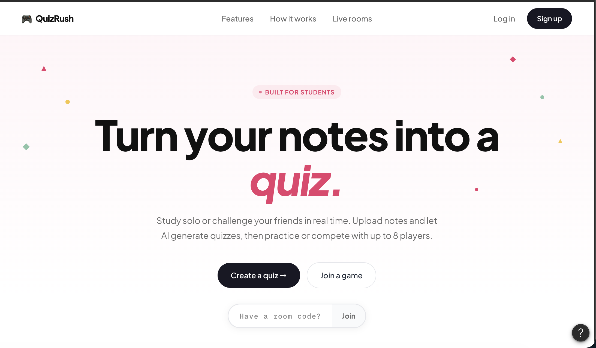

# Cortex

**Real-time multiplayer quizzes generated from your own notes.**

Upload a PDF, let an LLM generate validated multiple-choice questions, invite friends into a lobby, and compete in timed rounds over WebSockets.

Built as a full-stack systems project focused on real-time state management, durable persistence, and a production-shaped AI pipeline.



---

## Features

- **AI quiz pipeline** — PDF/text extraction → semantic chunking → Gemini generation → Zod schema validation with retry logic
- **Lobby-first UX** — create a room immediately; generation runs in the background with live status updates
- **Real-time multiplayer** — Socket.io lobby (join/ready/leave), auto-generated room codes, host-controlled game start
- **Split datastores** — Redis for ephemeral live game state (TTL'd); PostgreSQL for durable users, quizzes, and finished games
- **Placement scoring** — first-correct gets 100pts, second 75pts, third 50pts — atomic via Redis Lua scripts
- **Auth** — Clerk identity with webhook-provisioned user rows; JWT verified on both REST and WebSocket handshakes

---

## Tech Stack

| Layer | Technologies |
| --- | --- |
| **Frontend** | React 19, TypeScript, Vite, React Router, Tailwind CSS, Zustand, Socket.io client, Clerk |
| **Backend** | Node.js, Express 5, TypeScript, Socket.io, Zod, Multer, BullMQ |
| **AI** | Vercel AI SDK, Google Gemini |
| **Data** | PostgreSQL + Prisma 7, Redis 7 (ioredis) |
| **Infra** | Docker Compose |

---

## Architecture

```text
Upload notes (PDF / text)
        │
        ▼
Extract → semantic chunk → LLM batch generation → Zod validate (retry ×3)
        │
        ▼
Persist quiz (Postgres)  ──►  Create room (Redis)
                                    │
                         Socket.io lobby (join / ready / start)
                                    │
                                    ▼
                  Live rounds (Redis state + BullMQ delayed jobs)
                                    │
                                    ▼
                  Game end → single Postgres transaction (scores, ratings, answers)
```

**Design principle:** Redis holds ephemeral in-progress state. Postgres is the source of truth for anything that must survive a crash or matter after the session ends.

---

## Getting Started

### Prerequisites

- Node.js 20+ (22 recommended)
- Docker + Docker Compose
- PostgreSQL (local or hosted)
- [Clerk](https://clerk.com) app (publishable key, secret key, webhook secret)
- [Google Gemini API key](https://ai.google.dev/)

### Environment variables

```bash
# backend/.env
DATABASE_URL=
DIRECT_URL=
REDIS_URL=redis://localhost:6379
CLIENT_ORIGIN=http://localhost:5173
CLERK_PUBLISHABLE_KEY=
CLERK_SECRET_KEY=
CLERK_WEBHOOK_SECRET=
GEMINI_API_KEY=

# frontend/.env
VITE_CLERK_PUBLISHABLE_KEY=
```

### Run with Docker Compose

```bash
docker compose up --build
```

| Service | URL |
| --- | --- |
| Frontend | http://localhost:5173 |
| Backend | http://localhost:3000 |
| Redis | localhost:6379 |

### Run locally (without Docker)

```bash
# Terminal 1 — Redis
docker compose up redis

# Terminal 2 — Backend
cd backend
npm install
npx prisma migrate dev
npm run dev

# Terminal 3 — Frontend
cd frontend
npm install
npm run dev
```

---

## Scripts

```bash
cd backend
npm run dev                    # start dev server with hot reload
npm test                       # run unit/integration tests
npm run seed:quiz              # seed a sample quiz
npm run smoke:quiz-pipeline    # end-to-end pipeline smoke test
```

---

## Project Structure

```text
cortex/
├── backend/
│   ├── prisma/              # schema + migrations
│   ├── scripts/             # seeds and smoke tests
│   └── src/
│       ├── controllers/     # HTTP route handlers
│       ├── routes/          # Express route mounting
│       ├── middleware/      # auth guards
│       ├── schemas/         # Zod request/response schemas
│       ├── services/        # domain logic
│       │   └── quiz/        # extract → chunk → generate → validate → persist
│       ├── socket/          # Socket.io lobby + game handlers
│       ├── workers/         # BullMQ job consumers (round timer)
│       ├── webhooks/        # Clerk user.created provisioning
│       ├── lib/             # Redis client, key builders, utilities
│       └── types/           # shared TypeScript types
├── frontend/
│   └── src/
│       ├── pages/           # landing, auth, dashboard, lobby, game
│       ├── components/      # UI components by feature
│       ├── hooks/           # socket + data hooks
│       ├── stores/          # Zustand state (lobby, game)
│       └── lib/             # API client, socket helper
├── docs/                    # architecture notes, design decisions
└── docker-compose.yml       # backend + frontend + Redis
```

---

## Roadmap

- [ ] End-to-end play loop polish (round UX, results screen, reconnect handling)
- [ ] Game completion transaction (ranks, answers, rating changes in one Postgres boundary)
- [ ] Multi-player ELO rating formula for 2–8 players
- [ ] Socket.io Redis adapter for multi-instance deployments
- [ ] Solo flashcard / practice mode
- [ ] Structured logging and generation metrics
- [ ] Horizontal scaling playbook
